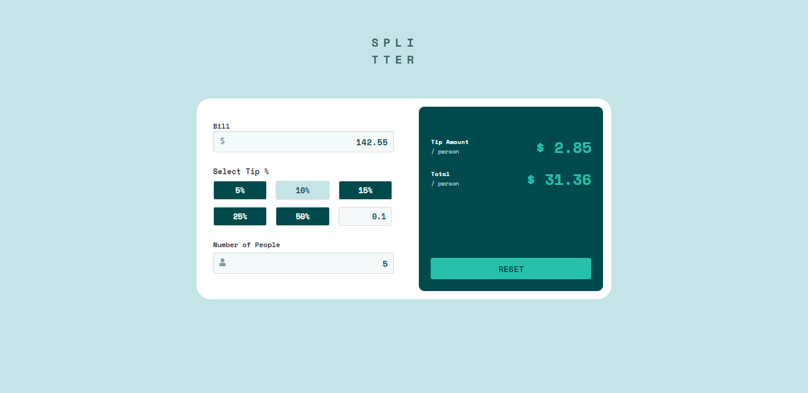

# Frontend Mentor - Tip calculator app solution

This is a solution to the [Tip calculator app challenge on Frontend Mentor](https://www.frontendmentor.io/challenges/tip-calculator-app-ugJNGbJUX). Frontend Mentor challenges help you improve your coding skills by building realistic projects.

## Table of contents

- [Overview](#overview)
  - [The challenge](#the-challenge)
  - [Screenshot](#screenshot)
  - [Links](#links)
- [My process](#my-process)
  - [Built with](#built-with)
  - [What I learned](#what-i-learned)
  - [Useful resources](#useful-resources)
- [Author](#author)
- [Project Setup](#author)


## Overview

### The challenge

Users should be able to:

- View the optimal layout for the app depending on their device's screen size
- See hover states for all interactive elements on the page
- Calculate the correct tip and total cost of the bill per person

### Screenshot




### Links

- Solution URL: [Add solution URL here](https://your-solution-url.com)
- Live Site URL: [Add live site URL here](https://your-live-site-url.com)

## My process

### Built with

- [Vue JS](https://v3.vuejs.org/) - JS library
- Sass
- Flexbox
- CSS Grid
- Mobile-first workflow


### What I learned

This project was my introduction to the VueJS library. The elements used in this project are divided into individual reusable components. Using directives like v-bind and v-model allow me to dynamical compute and render amounts passed into the calculator


A part of this project I am particularly proud of was how I decided to dynamic render an error message using slots and v-show. This was used in the InputField custom component in the Calculator component
```vue
<p v-show="peopleNumValue === 0" class="label is-small has-text-danger">Can't Be Zero</p>
```
```html
<div id="input-label-group">
  <label class="label">{{inputLabel}}</label>
  <slot></slot>
</div>
```


### Useful resources

- [Building Advanced Components in Vue 3 using $attrs](https://www.thisdot.co/blog/build-advanced-components-in-vue-3-using-usdattrs/) - This article show me how to declare html attributes not declared in a parent class from a child class. Without this I wasnt able put a red border on the input field based on a condition. 
- [Passing Value From Clicked Button As Prop](https://stackoverflow.com/questions/69331614/passing-value-from-clicked-button-as-a-prop/69333288#69333288) - This amazing answer on StackOverflow showed me the best way to assign value to each tip button and how to pass that value as a prop when each respective one is clicked.


## Author

- Frontend Mentor - [@zencoder24](https://www.frontendmentor.io/profile/zencoder24)
- Twitter - [@devrowdyroddy](https://www.twitter.com/devrowdyroddy)


## Project setup
```
npm install
```

### Compiles and hot-reloads for development
```
npm run serve
```

### Compiles and minifies for production
```
npm run build
```

### Customize configuration
See [Configuration Reference](https://cli.vuejs.org/config/).


